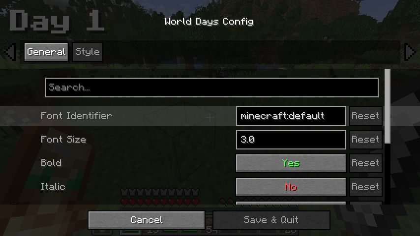

# World Days

## What is it

Have you ever watched "100 days in Minecraft" series? Have you ever wondered about how many days have passed in your world?
Now, with this mod, you can easily customize your HUD to show the Day Counter on your screen!
Any Color, Any Size, Any Style, and even Your Own Custom Fonts!

## How to use

You can visit [wiki](https://github.com/JustS-js/World-Days/wiki) to lear more about customization!

## Dependencies

It is essential to use [Fabric-API](https://modrinth.com/mod/fabric-api) with this mod.

It is not necessary, but you may use [Mod Menu](https://github.com/TerraformersMC/ModMenu) and [Cloth Config API](https://github.com/shedaniel/cloth-config) for better experience.

## License

This piece of software is available under the CC-BY-4.0 license. Feel free to learn from it.
